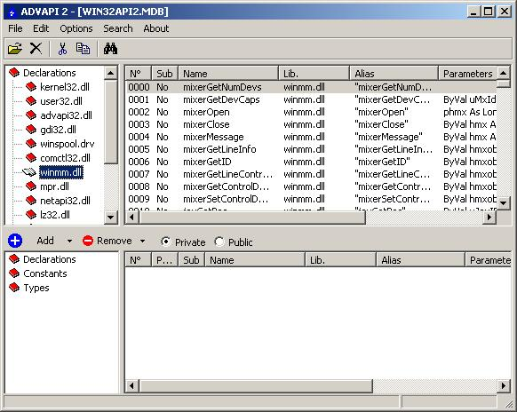



## ADVAPI 2

### Description

Do you remeber ADVAPI? No???

Ok, ADVAPI stand for ADVANCED API VIEWER, and the new version (2) will replace definitively the API viewer in Visual Basic. ADVAPI 2 it's the perfect thing to search/manage API declaration, types or constants. It allows you to search for a particular declare in multipe way, by: Index - Sub or Function - Name - Library - Alias - parameters and return type of a funciton.

Besides, it permit you to search for const and types, and to check dependencies when you add types or declares... Try it and please, vote!!!

PS: I don't know if the project it's compatible with early version of Visual Basic, you have to test it.

MeDevil
 
### More Info
 

             |
---                |---
**Submitted On**   |2002-06-11 21:27:36
**By**             |[MeDevil84](https://github.com/Planet-Source-Code/PSCIndex/blob/master/ByAuthor/medevil84.md)
**Level**          |Intermediate
**User Rating**    |4.7 (47 globes from 10 users)
**Compatibility**  |VB 6\.0
**Category**       |[Complete Applications](https://github.com/Planet-Source-Code/PSCIndex/blob/master/ByCategory/complete-applications__1-27.md)
**World**          |[Visual Basic](https://github.com/Planet-Source-Code/PSCIndex/blob/master/ByWorld/visual-basic.md)
**Archive File**   |[ADVAPI\_2952086162002\.zip](https://github.com/Planet-Source-Code/medevil84-advapi-2__1-35918/archive/master.zip)

